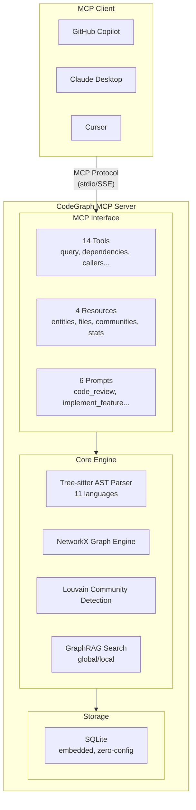

title: ゼロ構成で動く！コードグラフ分析MCPサーバー「CodeGraph MCP」の紹介

# 第1章 はじめに

## 1.1 この記事で紹介するもの

**CodeGraph MCP Server** は、ソースコード分析に特化したMCP（Model Context Protocol）サーバーです。

AIコーディングアシスタント（GitHub Copilot、Claude Desktop、Cursor等）と連携し、コードベースの構造的理解を提供します。

**主な特徴:**
- ゼロ構成で即座に起動（外部DB不要）
- 11言語対応（Python, TypeScript, JavaScript, Rust, Go, Java, PHP, C#, C++, HCL, Ruby）
- GraphRAG機能によるコードベース全体の理解
- 14種のMCPツール、4種のリソース、6種のプロンプト

## 1.2 対象読者

- AIアシスタントを活用してコーディング効率を上げたい開発者
- 大規模コードベースの理解・ナビゲーションに課題を感じる方
- MCPサーバーの実装例を知りたい方

---

# 第2章 背景と課題

## 2.1 AIコーディングアシスタントの限界

現在のAIコーディングアシスタントには以下の課題があります。

| 課題 | 詳細 |
|------|------|
| ファイル単位の理解 | モジュール間の依存関係を認識できない |
| 呼び出し追跡の困難 | 関数の呼び出し元・呼び出し先を把握しにくい |
| 全体像の欠如 | アーキテクチャパターンを認識できない |

## 2.2 既存ソリューションの課題

code-graph-ragなどの既存ソリューションは外部データベース（Memgraph等）の設定が必要で、導入障壁が高いという課題がありました。

---

# 第3章 CodeGraph MCPの特徴

## 3.1 ゼロ構成起動

```bash
# 仮想環境を作成・有効化
python -m venv .venv
source .venv/bin/activate  # Linux/macOS
# .venv\Scripts\activate   # Windows

# インストール
pip install codegraph-mcp-server

# インデックス作成
codegraph-mcp index /path/to/your/project --full

# サーバー起動
codegraph-mcp serve --repo /path/to/your/project
```

外部データベース不要。SQLiteによる組み込みグラフエンジンで動作します。

## 3.2 アーキテクチャ



## 3.3 対応言語

| 言語 | クラス | 関数 | メソッド | インターフェース |
|------|--------|------|----------|-----------------|
| Python | ✅ | ✅ | ✅ | ✅ (Protocol) |
| TypeScript | ✅ | ✅ | ✅ | ✅ |
| JavaScript | ✅ | ✅ | ✅ | - |
| Rust | ✅ (struct) | ✅ | ✅ (impl) | ✅ (trait) |
| Go | ✅ (struct) | ✅ | ✅ | ✅ |
| Java | ✅ | ✅ | ✅ | ✅ |
| PHP | ✅ | ✅ | ✅ | ✅ |
| C# | ✅ | - | ✅ | ✅ |
| C++ | ✅ | ✅ | ✅ | - |
| HCL (Terraform) | - | - | - | - |
| Ruby | ✅ | ✅ | ✅ | - |

---

# 第4章 MCPツール

## 4.1 グラフクエリツール（6種）

```python
# 自然言語でコードを検索
query_codebase(query="認証ロジック", max_results=10)

# 依存関係を検索
find_dependencies(entity_id="UserService", depth=2)

# 呼び出し元を検索
find_callers(entity_id="authenticate")

# 呼び出し先を検索
find_callees(entity_id="authenticate")

# インターフェース実装を検索
find_implementations(entity_id="AuthProvider")

# モジュール構造を分析
analyze_module_structure(file_path="src/auth/service.py")
```

## 4.2 コード取得ツール（3種）

```python
# エンティティのソースコードを取得
get_code_snippet(entity_id="UserService.authenticate", include_context=True)

# ファイル内容を取得
read_file_content(file_path="src/auth/service.py", start_line=10, end_line=50)

# ファイル構造を取得
get_file_structure(file_path="src/auth/service.py")
```

## 4.3 GraphRAGツール（2種）

```python
# コミュニティ横断のグローバル検索
global_search(query="このプロジェクトの主要なコンポーネントは？")

# エンティティ近傍のローカル検索
local_search(query="認証フロー", entity_id="AuthController")
```

## 4.4 管理ツール（3種）

```python
# リファクタリング提案
suggest_refactoring(entity_id="UserService", type="extract_method")

# リポジトリを再インデックス
reindex_repository(incremental=True)

# シェルコマンド実行
execute_shell_command(command="git log -5", timeout=30)
```

---

# 第5章 使用例

## 5.1 クイックスタート

### ステップ1: インストール

```bash
# 仮想環境を作成・有効化
python -m venv .venv
source .venv/bin/activate  # Linux/macOS
# .venv\Scripts\activate   # Windows

# インストール
pip install codegraph-mcp-server
```

### ステップ2: インデックス作成

```bash
codegraph-mcp index /path/to/your/project --full
```

出力例:
```
Indexed 16 entities, 37 relations in 0.81s
```

### ステップ3: MCPサーバー起動

```bash
codegraph-mcp serve --repo /path/to/your/project
```

## 5.2 MCPクライアント設定

### Claude Desktop

`~/.config/claude/claude_desktop_config.json`:

```json
{
  "mcpServers": {
    "codegraph": {
      "command": "codegraph-mcp",
      "args": ["serve", "--repo", "/path/to/your/project"]
    }
  }
}
```

### VS Code (GitHub Copilot)

`.vscode/settings.json`:

```json
{
  "mcp.servers": {
    "codegraph": {
      "command": "codegraph-mcp",
      "args": ["serve", "--repo", "${workspaceFolder}"]
    }
  }
}
```

### Cursor

`~/.cursor/mcp.json`:

```json
{
  "mcpServers": {
    "codegraph": {
      "command": "codegraph-mcp",
      "args": ["serve", "--repo", "/path/to/your/project"]
    }
  }
}
```

## 5.3 AIアシスタントとの対話例

### 例1: 依存関係の確認

```
You: UserServiceクラスの依存関係を教えて

AI: [find_dependencies ツールを使用]
    UserServiceは以下に依存しています:
    - DatabaseConnection (database.py)
    - Logger (utils/logging.py)
    - UserRepository (repositories/user.py)
```

### 例2: 影響範囲分析

```
You: authenticateメソッドを変更した場合の影響範囲は？

AI: [find_callers ツールを使用]
    authenticateの呼び出し元:
    - LoginController.login() (controllers/auth.py:45)
    - APIMiddleware.verify_token() (middleware/api.py:23)
    - TestUserService.test_auth() (tests/test_user.py:78)
```

### 例3: プロジェクト全体の理解

```
You: このプロジェクトの主要なコンポーネントを説明して

AI: [global_search ツールを使用]

    このプロジェクトは3層アーキテクチャで構成されています:
    1. Controllers層: HTTPリクエストの処理
    2. Services層: ビジネスロジック
    3. Repositories層: データアクセス
```

---

# 第6章 パフォーマンス

## 6.1 性能目標

| メトリクス | 目標値 | 実測値 |
|-----------|--------|--------|
| 初回インデックス (10万行) | < 30秒 | 21秒 |
| 増分インデックス | < 2秒 | < 1秒 |
| クエリレスポンス | < 500ms | < 2ms |
| 起動時間 | < 2秒 | < 1秒 |
| メモリ使用量 | < 500MB | ~200MB |

## 6.2 テスト実績

```
286 tests passed, 1 skipped
Coverage: 80%+
```

---

# 第7章 技術スタック

| カテゴリ | 技術 |
|----------|------|
| 言語 | Python 3.11+ |
| AST解析 | Tree-sitter |
| グラフエンジン | NetworkX |
| コミュニティ検出 | Louvain Algorithm |
| ストレージ | SQLite (aiosqlite) |
| MCPプロトコル | MCP Python SDK |
| CLI | Typer + Rich |

---

# 第8章 まとめ

## 8.1 CodeGraph MCPの利点

1. **ゼロ構成**: 外部DB不要、`pip install`で即座に利用開始
2. **軽量・高速**: 10万行を30秒以内でインデックス
3. **多言語対応**: 11言語をサポート
4. **GraphRAG**: コードベース全体の理解を提供
5. **MCP Native**: 14ツール、4リソース、6プロンプトの包括的実装

## 8.2 リンク

- **GitHub**: https://github.com/nahisaho/CodeGraphMCPServer
- **PyPI**: https://pypi.org/project/codegraph-mcp/

## 8.3 今後の展望

- VS Code Extension の直接統合
- Web UIによるグラフ可視化ダッシュボード
- マルチリポジトリ対応（モノレポ）
- リアルタイム更新（LSP統合）

---

# 参考資料

- [Model Context Protocol Specification](https://spec.modelcontextprotocol.io/)
- [Microsoft GraphRAG](https://github.com/microsoft/graphrag)
- [Tree-sitter Documentation](https://tree-sitter.github.io/tree-sitter/)
- [MCP Python SDK](https://github.com/modelcontextprotocol/python-sdk)
