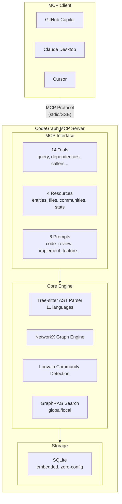
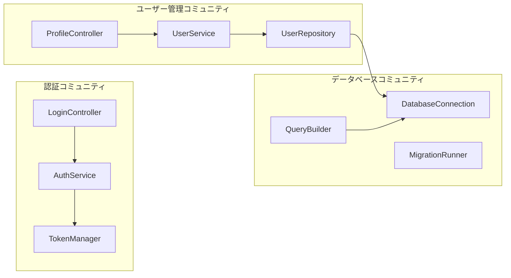

title: ゼロ構成で動く！コードグラフ分析MCPサーバー「CodeGraph MCP」の紹介

# 第1章 はじめに

## 1.1 この記事で紹介するもの

**CodeGraph MCP Server** は、ソースコード分析に特化したMCP（Model Context Protocol）サーバーです。

AIコーディングアシスタント（GitHub Copilot、Claude Desktop、Cursor等）と連携し、コードベースの構造的理解を提供します。

**主な特徴:**
- ゼロ構成で即座に起動（外部DB不要）
- 11言語対応（Python, TypeScript, JavaScript, Rust, Go, Java, PHP, C#, C++, HCL, Ruby）
- GraphRAG機能によるコードベース全体の理解
- 14種のMCPツール、4種のリソース、6種のプロンプト
- **NEW (v0.6.2)**: 部分一致ID検索、自動コミュニティ検出、スコアリング付きクエリ

## 1.2 対象読者

- AIアシスタントを活用してコーディング効率を上げたい開発者
- 大規模コードベースの理解・ナビゲーションに課題を感じる方
- MCPサーバーの実装例を知りたい方

---

# 第2章 背景と課題

## 2.1 AIコーディングアシスタントの限界

GitHub Copilot、Claude、Cursorなど、AIコーディングアシスタントは開発効率を大幅に向上させました。しかし、大規模コードベースを扱う際には以下の課題があります。

### 課題1: ファイル単位の理解に留まる

AIアシスタントは現在開いているファイルや直接参照されるファイルは理解できますが、プロジェクト全体のモジュール間依存関係を把握することは困難です。

```
例: UserService を修正したい場合
├── UserService.py      ← AIはこのファイルを理解
├── AuthController.py   ← UserServiceを呼び出しているが、AIは認識しにくい
├── UserRepository.py   ← UserServiceが依存しているが、関係性が不明
└── tests/test_user.py  ← テストファイルの存在を見落としやすい
```

### 課題2: 呼び出し追跡の困難

「この関数を変更したら、どこに影響するか？」という質問に正確に答えることが難しい状況です。

- **呼び出し元（Callers）**: どのコードがこの関数を呼んでいるか
- **呼び出し先（Callees）**: この関数がどのコードを呼んでいるか
- **間接的な依存**: 2段階以上離れた依存関係

### 課題3: アーキテクチャパターンの認識不足

プロジェクト全体がどのような設計思想で作られているかを理解することが困難です。

| 理解できないこと | 影響 |
|------------------|------|
| レイヤー構造 | 適切なレイヤーにコードを配置できない |
| 命名規則 | 既存コードと一貫性のない命名になる |
| 共通パターン | 車輪の再発明をしてしまう |
| モジュール境界 | 責務の分離が曖昧になる |

## 2.2 既存ソリューションの課題

### code-graph-ragの制約

[code-graph-rag](https://github.com/vitali87/code-graph-rag)は優れたコードグラフ分析ツールですが、以下の導入障壁があります。

| 観点 | code-graph-rag | CodeGraph MCP Server |
|------|----------------|----------------------|
| グラフDB | Memgraph（外部依存） | SQLite（組み込み） |
| デプロイ | Docker必須 | `pip install`のみ |
| 起動時間 | 重い（DB起動含む） | 軽量（秒単位） |
| MCP統合 | 後付け対応 | ネイティブ設計 |
| GraphRAG | なし | コミュニティ要約対応 |

### 導入の複雑さ

従来のソリューションでは以下の手順が必要でした：

1. Dockerのインストール
2. Memgraphコンテナの起動
3. 接続設定の構成
4. データのインポート
5. クエリインターフェースの設定

CodeGraph MCP Serverはこれらをすべて不要にし、**1コマンドで起動可能**にしました。

---

# 第3章 CodeGraph MCPの特徴

## 3.1 ゼロ構成起動

```bash
# 仮想環境を作成・有効化
python -m venv .venv
source .venv/bin/activate  # Linux/macOS
# .venv\Scripts\activate   # Windows

# インストール
pip install codegraph-mcp-server

# インデックス作成（初回はフルインデックス）
codegraph-mcp index /path/to/your/project --full

# コミュニティ検出をスキップ（大規模リポジトリ向け）
codegraph-mcp index /path/to/your/project --full --no-community

# サーバー起動（バックグラウンド）
codegraph-mcp start --repo /path/to/your/project

# サーバー状態確認
codegraph-mcp status

# サーバー停止
codegraph-mcp stop

# ソースコード変更後は増分インデックスで更新
codegraph-mcp index /path/to/your/project
```

外部データベース不要。SQLiteによる組み込みグラフエンジンで動作します。増分インデックスはGit差分を活用し、変更ファイルのみを再インデックスするため高速です。

## 3.2 アーキテクチャ



## 3.3 コミュニティ検出とは

### コミュニティ検出の概要

**コミュニティ検出**とは、コードグラフ内で密接に関連するエンティティ（関数、クラス、モジュール）を自動的にグループ化する技術です。CodeGraph MCPでは**Louvainアルゴリズム**を使用しています。



### なぜコミュニティ検出が重要か

| 用途 | 説明 |
|------|------|
| **アーキテクチャ理解** | プロジェクトの論理的な構造を自動で把握 |
| **影響範囲分析** | 変更がどのコミュニティに影響するか特定 |
| **オンボーディング** | 新メンバーがコードベースを素早く理解 |
| **リファクタリング** | モジュール境界の改善ポイントを発見 |

### コミュニティ検出の仕組み

1. **グラフ構築**: コードエンティティ間の関係（呼び出し、依存、継承）をグラフ化
2. **Louvainアルゴリズム**: モジュラリティを最大化するようにノードをクラスタリング
3. **階層構造**: 複数レベルのコミュニティを検出（細粒度〜粗粒度）
4. **サマリー生成**: 各コミュニティの役割をLLMで要約（オプション）

### 実行例

```bash
# コミュニティ検出付きでインデックス（デフォルト）
codegraph-mcp index /path/to/project --full

# 出力例
Indexed 230,796 entities, 651,140 relations
Detected 456 communities in 3 levels
```

```bash
# コミュニティ検出をスキップ（高速化）
codegraph-mcp index /path/to/project --full --no-community
```

### GraphRAGとの連携

コミュニティ検出はGraphRAG機能の基盤となります。

- **global_search**: コミュニティサマリーを活用してコードベース全体を理解
- **local_search**: 特定エンティティが属するコミュニティ内で関連情報を検索

```python
# コミュニティを活用したグローバル検索
global_search(query="このプロジェクトの主要なコンポーネントは？")

# 結果例:
# このプロジェクトは以下の主要コミュニティで構成されています:
# 1. 認証コミュニティ (23エンティティ): ユーザー認証とトークン管理
# 2. API コミュニティ (45エンティティ): RESTエンドポイントとリクエスト処理
# 3. データ層コミュニティ (31エンティティ): データベースアクセスとORM
```

## 3.4 対応言語

| 言語 | クラス | 関数 | メソッド | インターフェース |
|------|--------|------|----------|-----------------|
| Python | ✅ | ✅ | ✅ | ✅ (Protocol) |
| TypeScript | ✅ | ✅ | ✅ | ✅ |
| JavaScript | ✅ | ✅ | ✅ | - |
| Rust | ✅ (struct) | ✅ | ✅ (impl) | ✅ (trait) |
| Go | ✅ (struct) | ✅ | ✅ | ✅ |
| Java | ✅ | ✅ | ✅ | ✅ |
| PHP | ✅ | ✅ | ✅ | ✅ |
| C# | ✅ | - | ✅ | ✅ |
| C++ | ✅ | ✅ | ✅ | - |
| HCL (Terraform) | - | - | - | - |
| Ruby | ✅ | ✅ | ✅ | - |

---

# 第4章 MCPツール

## 4.1 グラフクエリツール（6種）

```python
# 自然言語でコードを検索（スコアリング付き）
query_codebase(
    query="認証ロジック",
    max_results=10,
    include_related=True,      # NEW: 関連エンティティも含む
    entity_types=["function"]  # NEW: タイプでフィルタ
)

# 依存関係を検索（部分ID対応）
find_dependencies(entity_id="UserService", depth=2)  # 名前だけでOK
find_dependencies(entity_id="service.py::authenticate", depth=2)  # file::name形式

# 呼び出し元を検索（部分ID対応）
find_callers(entity_id="authenticate")  # 関数名だけで検索可能

# 呼び出し先を検索
find_callees(entity_id="authenticate")

# インターフェース実装を検索
find_implementations(entity_id="AuthProvider")

# モジュール構造を分析
analyze_module_structure(file_path="src/auth/service.py")
```

## 4.2 コード取得ツール（3種）

```python
# エンティティのソースコードを取得
get_code_snippet(entity_id="UserService.authenticate", include_context=True)

# ファイル内容を取得
read_file_content(file_path="src/auth/service.py", start_line=10, end_line=50)

# ファイル構造を取得
get_file_structure(file_path="src/auth/service.py")
```

## 4.3 GraphRAGツール（2種）

```python
# コミュニティ横断のグローバル検索
global_search(query="このプロジェクトの主要なコンポーネントは？")

# エンティティ近傍のローカル検索
local_search(query="認証フロー", entity_id="AuthController")
```

## 4.4 管理ツール（3種）

```python
# リファクタリング提案
suggest_refactoring(entity_id="UserService", type="extract_method")

# リポジトリを再インデックス
reindex_repository(incremental=True)

# シェルコマンド実行
execute_shell_command(command="git log -5", timeout=30)
```

---

# 第5章 使用例

## 5.1 クイックスタート

### ステップ1: インストール

```bash
# 仮想環境を作成・有効化
python -m venv .venv
source .venv/bin/activate  # Linux/macOS
# .venv\Scripts\activate   # Windows

# インストール
pip install codegraph-mcp-server
```

### ステップ2: インデックス作成

```bash
codegraph-mcp index /path/to/your/project --full
```

出力例:
```
Indexed 16 entities, 37 relations in 0.81s
```

### ステップ3: MCPサーバー起動

```bash
# バックグラウンドで起動
codegraph-mcp start --repo /path/to/your/project

# 状態確認
codegraph-mcp status

# 停止
codegraph-mcp stop

# フォアグラウンドで起動（デバッグ用）
codegraph-mcp serve --repo /path/to/your/project
```

## 5.2 MCPクライアント設定

### Claude Desktop

`~/.config/claude/claude_desktop_config.json`:

```json
{
  "mcpServers": {
    "codegraph": {
      "command": "codegraph-mcp",
      "args": ["serve", "--repo", "/path/to/your/project"]
    }
  }
}
```

### VS Code (GitHub Copilot)

`.vscode/settings.json`:

```json
{
  "mcp.servers": {
    "codegraph": {
      "command": "codegraph-mcp",
      "args": ["serve", "--repo", "${workspaceFolder}"]
    }
  }
}
```

### Cursor

`~/.cursor/mcp.json`:

```json
{
  "mcpServers": {
    "codegraph": {
      "command": "codegraph-mcp",
      "args": ["serve", "--repo", "/path/to/your/project"]
    }
  }
}
```

## 5.3 AIアシスタントとの対話例

### 例1: 依存関係の確認

```
You: UserServiceクラスの依存関係を教えて

AI: [find_dependencies ツールを使用]
    UserServiceは以下に依存しています:
    - DatabaseConnection (database.py)
    - Logger (utils/logging.py)
    - UserRepository (repositories/user.py)
```

### 例2: 影響範囲分析

```
You: authenticateメソッドを変更した場合の影響範囲は？

AI: [find_callers ツールを使用]
    authenticateの呼び出し元:
    - LoginController.login() (controllers/auth.py:45)
    - APIMiddleware.verify_token() (middleware/api.py:23)
    - TestUserService.test_auth() (tests/test_user.py:78)
```

### 例3: プロジェクト全体の理解

```
You: このプロジェクトの主要なコンポーネントを説明して

AI: [global_search ツールを使用]

    このプロジェクトは3層アーキテクチャで構成されています:
    1. Controllers層: HTTPリクエストの処理
    2. Services層: ビジネスロジック
    3. Repositories層: データアクセス
```

---

# 第6章 パフォーマンス

## 6.1 性能目標

| メトリクス | 目標値 | 実測値 |
|-----------|--------|--------|
| 初回インデックス (10万行) | < 30秒 | 21秒 |
| 増分インデックス | < 2秒 | < 1秒 |
| クエリレスポンス | < 500ms | < 2ms |
| 起動時間 | < 2秒 | < 1秒 |
| メモリ使用量 | < 500MB | ~200MB |

## 6.2 大規模リポジトリ実績 (v0.6.2)

**Rustコンパイラリポジトリ** (rust-lang/rust) での実測:

| 項目 | 値 |
|------|------|
| ファイル数 | 34,474 |
| エンティティ数 | 230,796 |
| リレーション数 | 651,140 |
| インデックス時間 | ~128秒 |
| コミュニティ検出 | 456 communities |

## 6.3 テスト実績

```
300 tests passed, 1 skipped
Coverage: 80%+
```

---

# 第7章 技術スタック

| カテゴリ | 技術 |
|----------|------|
| 言語 | Python 3.11+ |
| AST解析 | Tree-sitter |
| グラフエンジン | NetworkX |
| コミュニティ検出 | Louvain Algorithm |
| ストレージ | SQLite (aiosqlite) |
| MCPプロトコル | MCP Python SDK |
| CLI | Typer + Rich |

---

# 第8章 まとめ

## 8.1 CodeGraph MCPの利点

1. **ゼロ構成**: 外部DB不要、`pip install`で即座に利用開始
2. **軽量・高速**: 10万行を30秒以内でインデックス
3. **多言語対応**: 11言語をサポート
4. **GraphRAG**: コードベース全体の理解を提供
5. **MCP Native**: 14ツール、4リソース、6プロンプトの包括的実装
6. **NEW: 部分ID検索**: 関数名だけでエンティティを特定
7. **NEW: スコアリング**: 関連度の高い結果を優先表示
8. **NEW: 自動コミュニティ**: インデックス時にコードクラスタを自動検出

## 8.2 リンク

- **GitHub**: https://github.com/nahisaho/CodeGraphMCPServer
- **PyPI**: https://pypi.org/project/codegraph-mcp-server/
- **バージョン**: v0.6.2 (2025-11-27)

## 8.3 今後の展望

- VS Code Extension の直接統合
- Web UIによるグラフ可視化ダッシュボード
- マルチリポジトリ対応（モノレポ）
- リアルタイム更新（LSP統合）

---

# 参考資料

- [Model Context Protocol Specification](https://spec.modelcontextprotocol.io/)
- [Microsoft GraphRAG](https://github.com/microsoft/graphrag)
- [Tree-sitter Documentation](https://tree-sitter.github.io/tree-sitter/)
- [MCP Python SDK](https://github.com/modelcontextprotocol/python-sdk)
